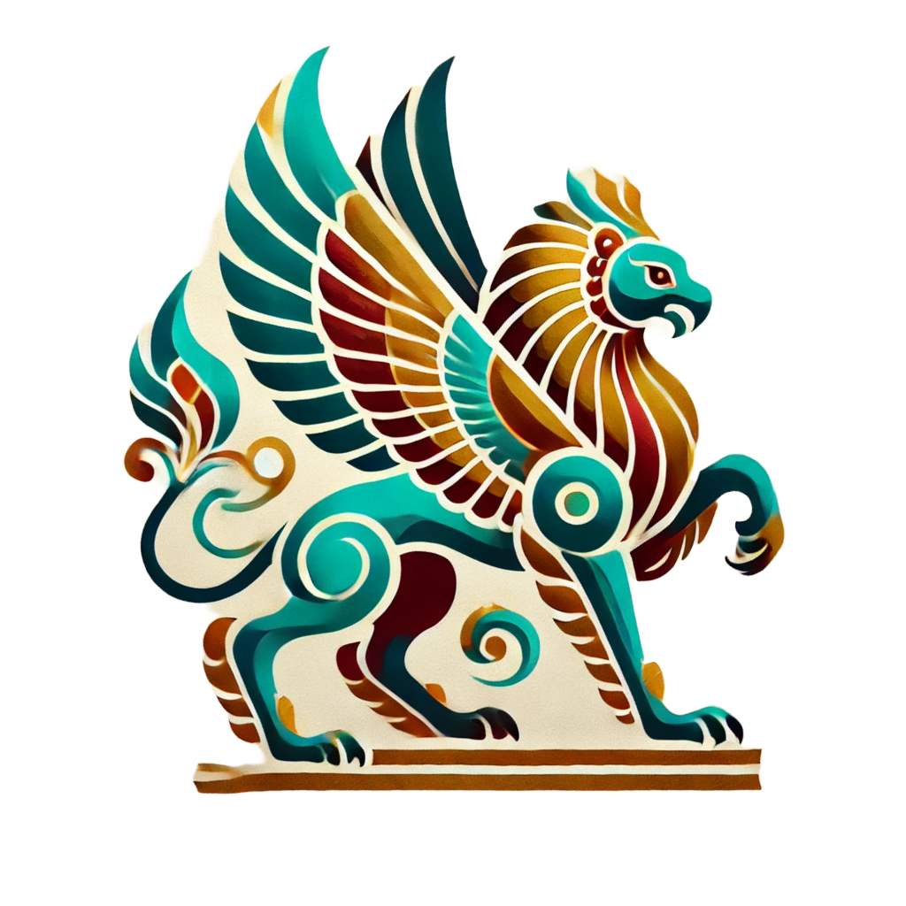

# Sherdal: A Hybrid Homomorphic Encryption Framework in Golang

	

This framework is based on the Lattigo library. Lattigo is maintained and supported by [Tune Insight
SA](https://tuneinsight.com).

## License

Sherdal is licensed under the Apache 2.0 License.
