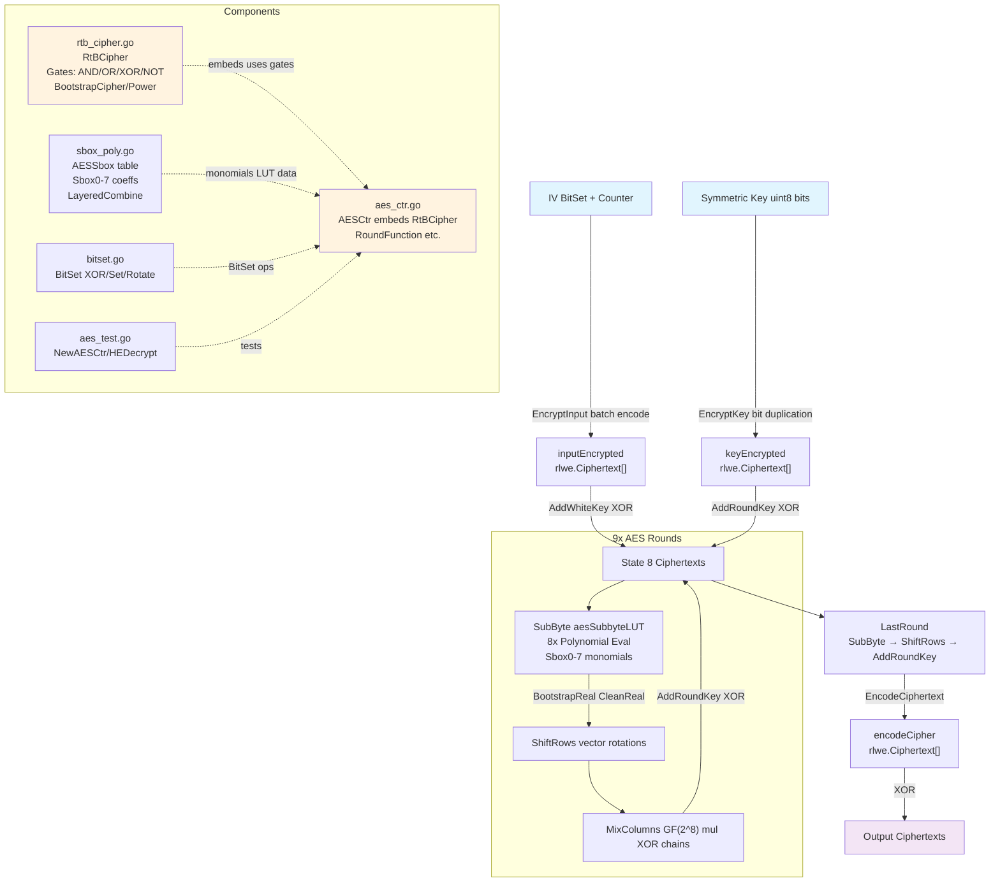

```mermaid
graph TD
    A["Symmetric Key uint8 bits"] -->|"EncryptKey bit duplication"| B["keyEncrypted<br/>rlwe.Ciphertext[]"]
    C["IV BitSet + Counter"] -->|"EncryptInput batch encode"| D["inputEncrypted<br/>rlwe.Ciphertext[]"]
    
    D -->|"AddWhiteKey XOR"| E["State 8 Ciphertexts"]
    B -->|"AddRoundKey XOR"| E
    
    subgraph Rounds["9x AES Rounds"]
        E --> F["SubByte aesSubbyteLUT<br/>8x Polynomial Eval<br/>Sbox0-7 monomials"]
        F -->|"BootstrapReal CleanReal"| G["ShiftRows vector rotations"]
        G --> H["MixColumns GF(2^8) mul XOR chains"]
        H -->|"AddRoundKey XOR"| E
    end
    
    E --> I["LastRound<br/>SubByte → ShiftRows → AddRoundKey"]
    I -->|"EncodeCiphertext"| J["encodeCipher<br/>rlwe.Ciphertext[]"]
    J -->|"XOR"| K["Output Ciphertexts"]
    
    subgraph Components["Components"]
        L["rtb_cipher.go<br/>RtBCipher<br/>Gates: AND/OR/XOR/NOT<br/>BootstrapCipher/Power"]
        M["sbox_poly.go<br/>AESSbox table<br/>Sbox0-7 coeffs<br/>LayeredCombine"]
        N["aes_ctr.go<br/>AESCtr embeds RtBCipher<br/>RoundFunction etc."]
        O["bitset.go<br/>BitSet XOR/Set/Rotate"]
        P["aes_test.go<br/>NewAESCtr/HEDecrypt"]
    end
    
    L -.->|"embeds uses gates"| N
    M -.->|"monomials LUT data"| N
    O -.->|"BitSet ops"| N
    P -.->|"tests"| N
    
    style A fill:#e1f5fe
    style C fill:#e1f5fe
    style K fill:#f3e5f5
    style L fill:#fff3e0
    style N fill:#fff3e0

```